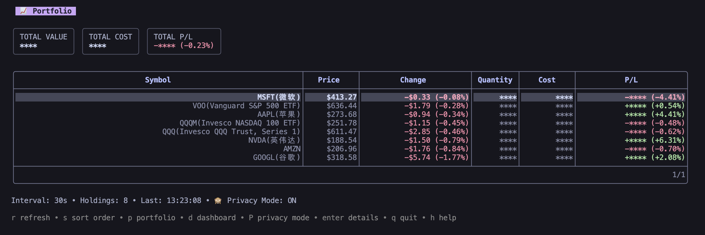
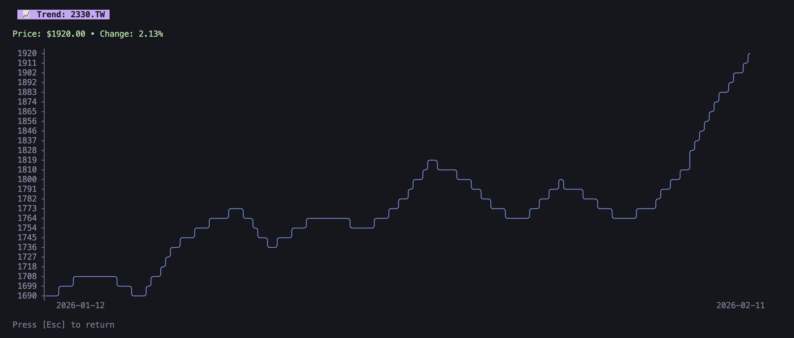

<p align="center">
  <pre align="center">
   ▄█████ ▄▄▄▄▄▄ ▄▄▄   ▄▄▄▄ ▄▄ ▄▄   █████▄ ▄▄ ▄▄  ▄▄  ▄▄▄▄
   ▀▀▀▄▄▄   ██  ██▀██ ██▀▀▀ ██▄█▀   ██▄▄█▀ ██ ███▄██ ██ ▄▄
   █████▀   ██  ▀███▀ ▀████ ██ ██   ██     ██ ██ ▀██ ▀███▀
  </pre>
</p>

<p align="center">
  <strong>🚀 A beautiful terminal stock monitoring dashboard with real-time alerts</strong>
</p>

<p align="center">
  <a href="#features">Features</a> •
  <a href="#screenshots">Screenshots</a> •
  <a href="#installation">Installation</a> •
  <a href="#quick-start">Quick Start</a> •
  <a href="#configuration">Configuration</a> •
  <a href="#usage">Usage</a> •
  <a href="#license">License</a>
</p>

---

**Stock Ping** is a lightweight, terminal-native stock monitoring tool built with Go. It provides a beautiful interactive TUI dashboard to track your portfolio and market movements in real-time, with push notifications to your phone when price alerts are triggered.

## ✨ Features

### 📊 Interactive TUI Dashboard

- **Portfolio View** — Track your holdings with real-time P/L calculations, cost basis, and return percentages at a glance
- **Market Dashboard** — Monitor all configured stocks with prices, daily changes, day range, open price, and previous close
- **Trend Chart** — View 30-day historical price trends as beautiful ASCII charts, right in your terminal
- **Three-View Navigation** — Seamlessly switch between Portfolio, Dashboard, and Trend views with keyboard shortcuts

### 🔔 Smart Push Notifications

- **Bark Integration** — Instant push notifications to your iOS device via [Bark](https://github.com/Finb/Bark)
- **Flexible Alert Rules** — Set alerts based on price thresholds (`price_above` / `price_below`) or percent change (`change_above` / `change_below`)
- **Edge-Triggered Alerts** — Notifications are sent only when conditions are *newly* triggered, avoiding alert fatigue from repeated notifications

### 🌍 Multi-Market Support

| Market | Examples | Data Source |
|--------|----------|-------------|
| 🇺🇸 US Stocks | `AAPL`, `GOOGL`, `TSLA` | Finnhub API |
| 🇨🇳 China A-Shares | `600519.SS` | Yahoo Finance |
| 🇹🇼 Taiwan Stocks | `2330.TW` | Yahoo Finance |
| 🪙 Crypto | `BTC-USD`, `ETH-USD` | Yahoo Finance |
| 💱 Forex & Commodities | `XAU-USD` | Yahoo Finance |

Market-aware scheduling automatically pauses data fetching during off-hours and resumes when markets open.

### 🛠 More Highlights

- **Config Hot-Reload** — Edit `~/.stock-ping.yaml` while the dashboard is running; changes apply instantly with no restart needed
- **Privacy Mode** — Toggle privacy mode (`P`) to mask sensitive financial data — perfect for screenshots or screen sharing
- **Portfolio Management** — CLI commands to add, list, and remove holdings with automatic cost-averaging on position additions
- **Sorting & Pagination** — Sort stocks by daily change (ascending/descending) and paginate through large watchlists
- **Lightweight & Fast** — Single binary, zero external runtime dependencies, minimal memory footprint
- **Beautiful Catppuccin Theme** — Carefully crafted color palette based on [Catppuccin Mocha](https://catppuccin.com/) for a premium terminal experience

## 📸 Screenshots

### Portfolio View

> Track your holdings, current value, total cost, and P/L at a glance. Privacy mode masks sensitive data.




### Dashboard View
> Monitor all configured stocks with prices, daily changes, day range, open price, and previous close


### Trend View

> Select any stock and view its 30-day price history as an ASCII chart.




## 📦 Installation

### From Source

```bash
git clone https://github.com/congregalis/stock-ping.git
cd stock-ping

go build -o stock-ping .

# (Optional) Install to your $GOPATH/bin
go install .
```

### Requirements

- Go 1.25+
- A [Finnhub](https://finnhub.io/) API key (free tier available)
- *(Optional)* [Bark](https://github.com/Finb/Bark) for iOS push notifications

## 🚀 Quick Start

### 1. Create your config file

```bash
cp example.stock-ping.yaml ~/.stock-ping.yaml
```

### 2. Add your API key

Edit `~/.stock-ping.yaml` and fill in your Finnhub API key:

```yaml
finnhub:
  api_key: "your_finnhub_api_key"
```

### 3. Add stocks to monitor

```bash
# Quick add (auto-detects market and fetches stock name)
stock-ping add --symbol AAPL --price-above 200
stock-ping add --symbol 600519.SS --change-above 3

# Or manually edit ~/.stock-ping.yaml
```

### 4. Add your holdings

```bash
stock-ping holding add --symbol AAPL --quantity 100 --cost 150.50
stock-ping holding add --symbol NVDA --quantity 50 --cost 120.00
```

### 5. Launch the dashboard 🎉

```bash
stock-ping dashboard
# or
stock-ping ui
```

## ⚙️ Configuration

The config file lives at `~/.stock-ping.yaml`. Here's a full example:

```yaml
# Finnhub API (free: https://finnhub.io/)
finnhub:
  api_key: "your_api_key"

# Bark Push Notifications (iOS: https://github.com/Finb/Bark)
bark:
  server_url: "https://api.day.app"
  key: "your_bark_key"

# Refresh interval in seconds
interval: 30

# Monitoring rules
rules:
  - symbol: AAPL
    market: US
    name: Apple Inc.
    price_above: 200.00
    change_below: -2.0

  - symbol: BTC-USD
    market: CRYPTO
    name: Bitcoin
    change_above: 5.0

  - symbol: 600519.SS
    market: CN
    name: Kweichow Moutai
    change_above: 3.0
    change_below: -3.0

  - symbol: 2330.TW
    market: TW
    name: TSMC
    price_above: 600

  - symbol: XAU-USD
    market: FOREX
    name: Gold
    price_below: 2000

# Portfolio holdings
holdings:
  - symbol: AAPL
    quantity: 100
    cost_price: 150.50
  - symbol: NVDA
    quantity: 50
    cost_price: 120.00
```

### Alert Conditions

| Condition | Description |
|-----------|-------------|
| `price_above` | Alert when price rises above the threshold |
| `price_below` | Alert when price drops below the threshold |
| `change_above` | Alert when daily gain exceeds the percentage |
| `change_below` | Alert when daily loss exceeds the percentage (use negative value) |

## 📖 Usage

### Commands

| Command | Description |
|---------|-------------|
| `stock-ping dashboard` | Launch the interactive TUI dashboard |
| `stock-ping ui` | Alias for `dashboard` |
| `stock-ping watch` | Text-mode continuous monitoring (no TUI) |
| `stock-ping once <SYMBOL>` | Query a single stock's current price |
| `stock-ping add [options]` | Quickly add a monitoring rule |
| `stock-ping holding add` | Add a portfolio holding |
| `stock-ping holding list` | List all holdings |
| `stock-ping holding remove` | Remove a holding |
| `stock-ping config add` | Add a monitoring rule |
| `stock-ping config list` | List all rules |
| `stock-ping config remove` | Remove a rule |
| `stock-ping version` | Show version |

### Keyboard Shortcuts (Dashboard)

| Key | Action |
|-----|--------|
| `r` | Refresh all stocks |
| `s` | Toggle sort order (ascending/descending by change) |
| `p` | Switch to Portfolio view |
| `d` | Switch to Dashboard view |
| `P` | Toggle Privacy mode |
| `Enter` | View 30-day trend chart for selected stock |
| `Esc` | Go back |
| `q` | Quit |
| `h` | Help |

### Quick Query

```bash
$ stock-ping once AAPL
📈 AAPL (Apple Inc.)
   Price: $273.68
   Change: -$0.94 (-0.34%)
   Range:  $272.50 ~ $275.80
```

### Portfolio Management

```bash
# Add a new holding (auto-creates monitoring rule if needed)
$ stock-ping holding add --symbol AAPL --quantity 100 --cost 150.50
✅ Added holding for AAPL: 100.00 shares @ $150.50

# Add to existing position (auto-averages cost basis)
$ stock-ping holding add --symbol AAPL --quantity 50 --cost 170.00
ℹ️  Existing holding found: 100.00 shares @ $150.50
   Adding: 50.00 shares @ $170.00
   New Position: 150.00 shares @ $157.00

# List holdings
$ stock-ping holding list

# Remove a holding
$ stock-ping holding remove --symbol AAPL
```

## 🏗 Project Structure

```
stock-ping/
├── main.go              # Entry point & CLI routing
├── cmd/
│   ├── dashboard.go     # TUI dashboard launcher with hot-reload
│   ├── watch.go         # Text-mode continuous monitoring
│   ├── once.go          # Single stock query
│   ├── holding.go       # Portfolio holding management
│   └── config.go        # Rule configuration management
├── tui/
│   ├── model.go         # Bubble Tea model (state & logic)
│   ├── view_portfolio.go # Portfolio view renderer
│   ├── view_dashboard.go # Dashboard view renderer
│   ├── view_trend.go    # Trend chart view renderer
│   ├── styles.go        # Catppuccin-themed styles
│   ├── keys.go          # Keyboard shortcut definitions
│   └── messages.go      # Tea message types
├── stock/
│   ├── finnhub.go       # Finnhub API client (US stocks)
│   ├── yahoo.go         # Yahoo Finance client (global markets)
│   └── market.go        # Market hours & timezone logic
├── config/
│   └── config.go        # YAML config loading & management
├── notify/
│   └── bark.go          # Bark push notification client
├── rule/
│   └── evaluator.go     # Alert rule evaluation engine
├── watcher/
│   └── ...              # Config file watcher (fsnotify)
└── example.stock-ping.yaml
```

## 🤝 Contributing

Contributions are welcome! Please feel free to submit a Pull Request.

1. Fork the repository
2. Create your feature branch (`git checkout -b feature/amazing-feature`)
3. Commit your changes (`git commit -m 'Add amazing feature'`)
4. Push to the branch (`git push origin feature/amazing-feature`)
5. Open a Pull Request

## 📄 License

This project is licensed under the MIT License — see the [LICENSE](LICENSE) file for details.

## 🙏 Acknowledgements

- [Bubble Tea](https://github.com/charmbracelet/bubbletea) — TUI framework
- [Bubble Table](https://github.com/evertras/bubble-table) — Table component
- [Lip Gloss](https://github.com/charmbracelet/lipgloss) — Terminal styling
- [asciigraph](https://github.com/guptarohit/asciigraph) — ASCII line charts
- [Finnhub](https://finnhub.io/) — US stock market data
- [Yahoo Finance](https://finance.yahoo.com/) — Global market data
- [Bark](https://github.com/Finb/Bark) — iOS push notifications
- [Catppuccin](https://catppuccin.com/) — Color palette inspiration
